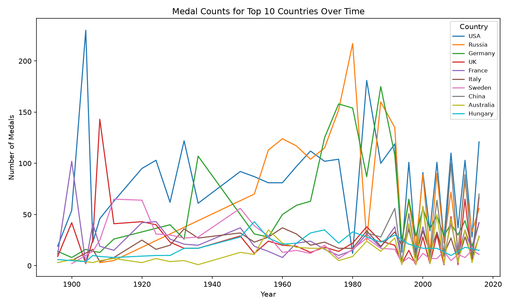
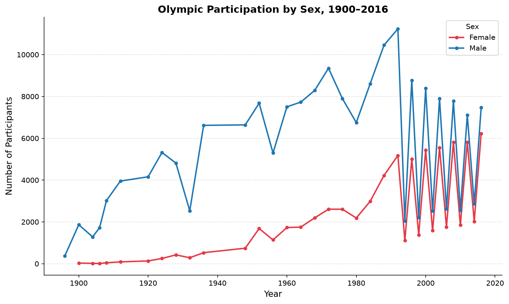
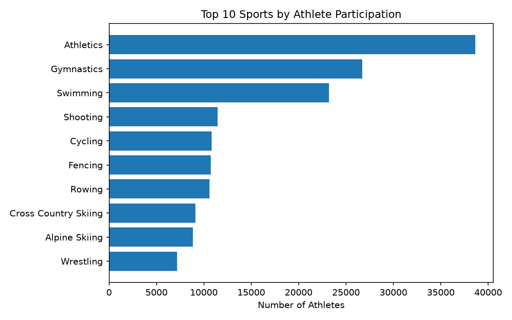

Here's a full README based on everything we built:

```markdown
# Olympic Games History Analysis

An exploratory data analysis of 120 years of Olympic history, focused on medal trends, participation shifts, and sport popularity. Built to practice merging/joining relational data — the second project in a data engineering portfolio series.

## Problem Statement

The Olympics have evolved dramatically since 1896 — in who competes, which countries dominate, and which sports draw the most athletes. This project explores three questions using historical athlete-level data:

1. Which countries have won the most Olympic medals of all time?
2. How has male vs. female participation changed over the last century?
3. Which sports attract the most athletes?

## Dataset

[120 Years of Olympic History: Athletes and Results](https://www.kaggle.com/datasets/heesoo37/120-years-of-olympic-history-athletes-and-results) (Kaggle)

Two files were used:

- `athlete_events.csv` — one row per athlete per event, including country, sport, age, and medal result
- `noc_regions.csv` — a lookup table mapping National Olympic Committee (NOC) codes to country names

## Data Cleaning & Preparation

- Removed 1,385 exact duplicate rows (identical across every column, including athlete ID) — concentrated almost entirely in early 20th-century Art Competitions entries
- Merged athlete data with `noc_regions` on `NOC` (left join) to attach readable country names
- Deduplicated team medal entries (same country, year, event, and medal) so team golds/silvers/bronzes are counted once, not once per team member

## Key Insights

- **Medal leaders:** the USA, USSR/Russia, and Germany rank among the highest all-time medal winners, with distinct surges tied to Olympic eras they dominated
- **Participation gap closing:** female participation was minimal in the early 1900s (under 40 athletes in 1900) and has grown steadily, especially from the 1980s onward
- **Athletics leads by far:** Athletics is the most-participated sport by a wide margin, followed by Gymnastics and Swimming — while niche historical sports like Aeronautics appear with only a handful of athletes ever
- **Season split matters:** medal counts show a jagged pattern after 1994, when the Winter and Summer Olympics stopped sharing the same year and began alternating on a 2-year offset

## Visualizations

**Medal counts for top 10 countries over time**


**Olympic participation by sex, 1900–2016**


**Top 10 sports by athlete participation**


## How to Run

1. Clone the repository
```

git clone https://github.com/ADAM11X/olympic-games-analysis.git
cd olympic-games-analysis

```

2. Create and activate a virtual environment
```

python -m venv venv
source venv/bin/activate.fish # fish shell

```

3. Install dependencies
```

pip install -r requirements.txt

```

4. Download the dataset from Kaggle and place `athlete_events.csv` and `noc_regions.csv` into `data/raw/`

5. Open and run `notebooks/olympic_analysis.ipynb`

## Project Structure

```

olympic-games-analysis/
├── data/
│ ├── raw/ # original CSVs (not tracked in git)
│ └── processed/ # cleaned, merged data (not tracked in git)
├── images/ # exported charts
├── notebooks/
│ └── olympic_analysis.ipynb
├── src/
├── .gitignore
├── README.md
└── requirements.txt

```

## Tools Used

Python, pandas, matplotlib, Jupyter Notebook

---

*Part of a self-directed data engineering learning path. See [Project #1: World Population Growth Analysis](https://github.com/ADAM11X/world-population-growth-analysis) for the previous project in this series.*
```
